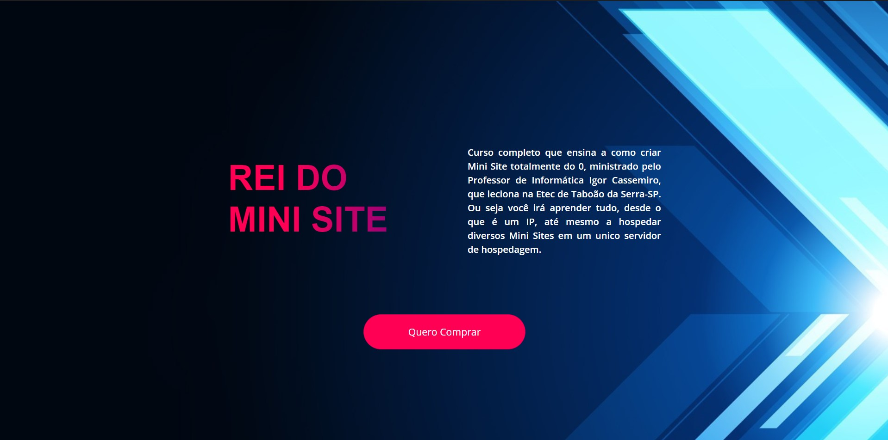

# ReidoSite
Site de divulgação de um projeto

  

  

## 🚀 Tecnologias

Esse projeto foi desenvolvido com as seguintes tecnologias:
- HTML
- CSS
- [Bootstrap](https://getbootstrap.com/)

## 💻 Projeto

O ReidoSite é um projeto criado com o intuito de auxiliar na divulgação de um curso de como criar um minisite oferecido por um professor. Apartir deste a visibilidade de seu produto aumentará e poderá atingir mais pessoas que querem acessar a um conteúdo de qualidade.

Feito por Vinicius Pereira Floriano Filho e Matteo Martins Camargo
